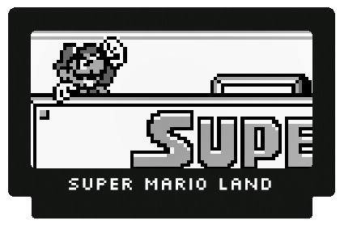

# Super Mario Land

## Description

A remake of the famous and great Super Mario Land released in 1989 on the Game Boy.
I have used the original screen resolution of 160 x 144 Pixels.

The creation of this remake took more time than expected.
Only the first level was implemented, with the following components to follow:

- Enemy Nokobon
- Enemy Fly
- Platform at the end of the level is not working properly yet
- Currently you can go several times into the tubes
- Small details

This is a remake of the original game for educational purposes.
The rights remain with Nintendo.

## Learn to use

* Phaser.Game
* Phaser.Config
* Phaser.Scenes.ScenePlugin
* Phaser.Loader
* Phaser.GameObjects.GameObjectCreator
* Phaser.Tilemaps.Tilemap
* Phaser.GameObject.Group
* Phaser.GameObject.Image
* Phaser.GameObject.Sprite
* Phaser.Physics.Arcade.ArcadePhysics
* Phaser.Cameras.Scene2D

## References and Resources

* [Spriters Resource](https://www.spriters-resource.com/game_boy_gbc/sml)
* [Super Mario Land Font by Patrick Lauke, CC BY 3.0 license](https://smartfonts.com/super-mario-land.font)
* [Nintendo Technical Data](https://www.nintendo.co.uk/Support/Game-Boy-Pocket-Color/Product-information/Technical-data/Technical-data-619585.html)
* [Generic Platformer and Phaser Bootstrap Project](https://github.com/nkholski/phaser3-es6-webpack)
